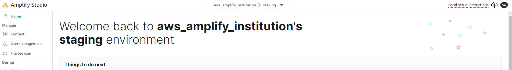

# Frame 기관 앱

Flutter + AWS Amplify project.

Flutter version
```
C:\flutter_project_android\aws_frame_institution>flutter --version
Flutter 3.18.0-19.0.pre.100 • channel master • https://github.com/flutter/flutter.git
Framework • revision 29a3746073 (2 days ago) • 2024-01-06 23:09:42 -0500
Engine • revision ffc84af478
Tools • Dart 3.3.0 (build 3.3.0-279.0.dev) • DevTools 2.31.0
```

## Getting Started

Terminal tool인 Amplify CLI가 설치되지 않았다면 설치를 해야 합니다.

- [Install the Amplify CLI guide line](https://docs.amplify.aws/flutter/start/getting-started/installation/)

오하이오 주(US-EAST-2)에 있는 기관 앱의 Amplify Studio에 들어가 오른쪽 상단에 있는 local setup instructions를 누른 후 나오는 명령어를 IDE(ex: 안드로이드 스튜디오)로 open한 clone 프로젝트 root 위치 터미널에서 실행합니다.



```
amplify pull --appId <실제 appId> --envName staging
```
AWS appsync 연결을 위한 configuration.dart 파일 구성

- ~~기관 앱 용 AWS appsync api를 프로젝트에 연결하기 위해서 다음의 명령어를 실행 ( 오하이오 주의 AWS appsync console에서 `Institution_API_NEW`라는 이름의 api의 id를 확인할 것)~~ -> 구버전

```
amplify add codegen --apiId <해당 api ID>
```

- 이미 구성된 configuration.dart 파일을 삽입
 


